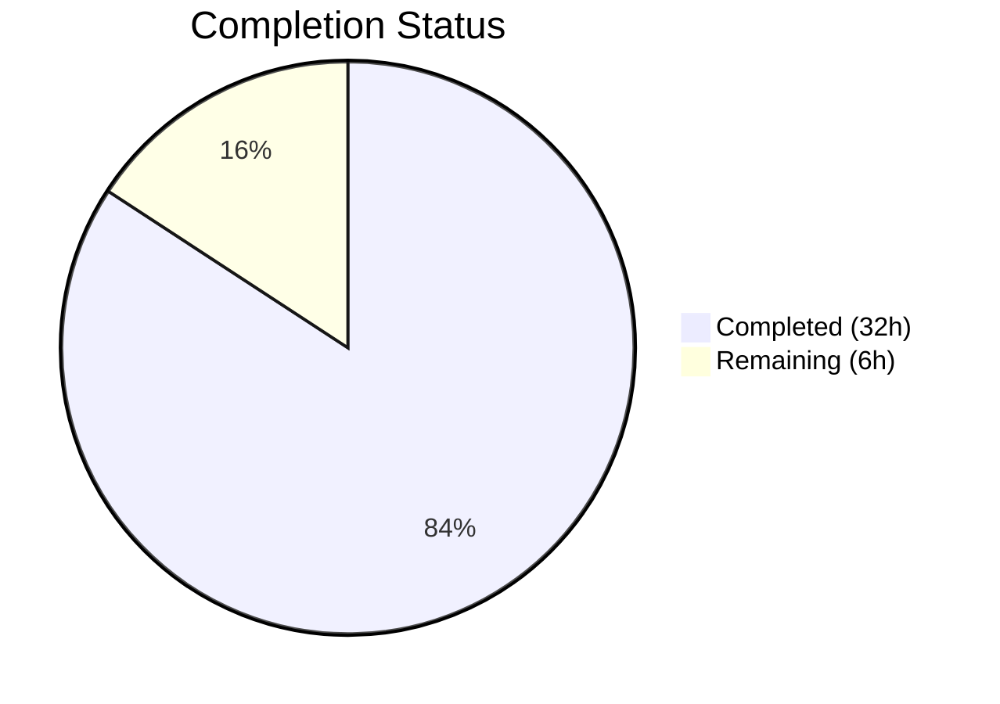
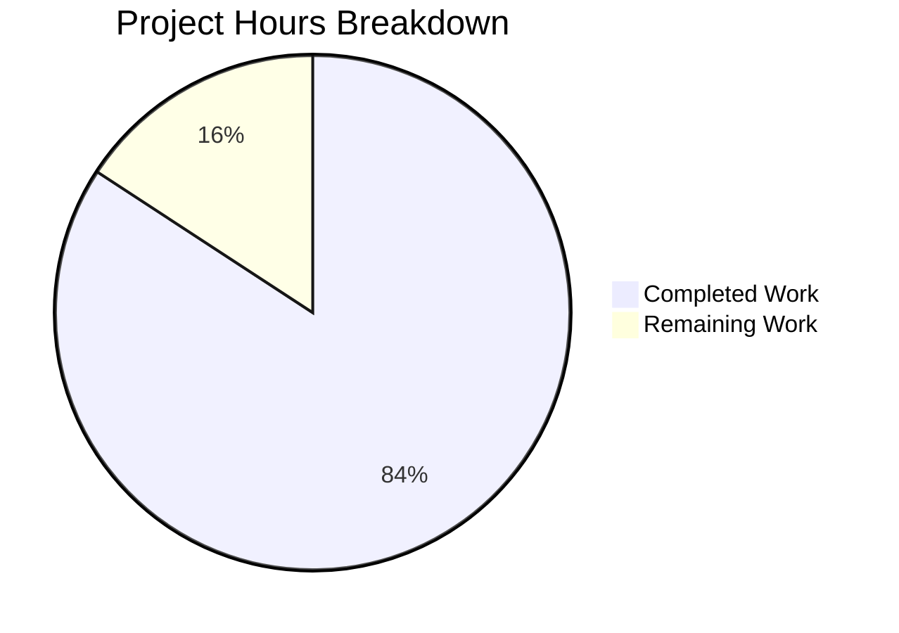

# Blitzy Project Guide — Arithmetic Calculator Feature

---

## 1. Executive Summary

### 1.1 Project Overview

This project adds an **Arithmetic Calculator feature** to an existing Java 21 console application repository. The calculator accepts two numeric values and an arithmetic operation (`+`, `-`, `*`, `/`, `%`) as input, performs the specified operation, and displays the result in a human-readable format (e.g., `10.0 + 5.0 = 15.0`). Built on a Maven Standard Directory Layout with a layered OOP architecture (model, service, validator, formatter, ui), the feature integrates with the planned Age Calculator application via a menu-driven entry point. The implementation includes 45 JUnit 5 unit tests covering all operations, edge cases, and error handling scenarios with a 100% pass rate.

### 1.2 Completion Status



| Metric | Value |
|--------|-------|
| **Total Project Hours** | **38** |
| **Completed Hours (AI)** | **32** |
| **Remaining Hours** | **6** |
| **Completion Percentage** | **84.2%** |

**Calculation:** 32 completed hours / (32 completed + 6 remaining) = 32 / 38 = **84.2% complete**

### 1.3 Key Accomplishments

- ✅ Created all 5 Calculator source files following layered OOP architecture (model, service, validator, formatter, ui)
- ✅ Implemented all 5 arithmetic operations: addition, subtraction, multiplication, division, modulus
- ✅ Built comprehensive error handling for division-by-zero, invalid numeric input, and unsupported operators
- ✅ Created application entry point with menu-driven routing between Age Calculator and Arithmetic Calculator
- ✅ Wrote 45 JUnit 5 unit tests across 3 test classes with 100% pass rate (0 failures, 0 errors, 0 skipped)
- ✅ Configured Maven build system with JDK 21, JUnit 5.10.2, compiler, surefire, and exec plugins
- ✅ Updated README.md with complete feature documentation, project structure, and build/run/test instructions
- ✅ Applied 3 QA fix iterations addressing formatting, null handling, security (NoSuchElementException), and documentation accuracy

### 1.4 Critical Unresolved Issues

| Issue | Impact | Owner | ETA |
|-------|--------|-------|-----|
| No standalone JAR packaging configured | Application cannot run as `java -jar` without maven-jar-plugin Main-Class manifest | Human Developer | 1 hour |
| Age Calculator feature is placeholder only | Menu option 1 displays "coming soon!" — not a blocker for Calculator feature scope | Human Developer | Out of current scope |

### 1.5 Access Issues

No access issues identified. The project uses only JDK 21 Standard Library and Maven Central dependencies (JUnit 5.10.2), all of which are publicly available. No private repositories, API keys, service credentials, or restricted resources are required.

### 1.6 Recommended Next Steps

1. **[High]** Conduct human code review of all 10 source and test files for adherence to enterprise coding standards and SRP compliance
2. **[Medium]** Perform manual end-to-end integration testing of all 5 arithmetic operations, all 3 error scenarios, and menu navigation on the target deployment environment
3. **[Medium]** Configure maven-jar-plugin with Main-Class manifest attribute for standalone JAR execution
4. **[Medium]** Conduct security hardening review — verify input validation handles extreme inputs (very long strings, Unicode, control characters)
5. **[Low]** Finalize README documentation — verify all sample I/O matches actual application output

---

## 2. Project Hours Breakdown

### 2.1 Completed Work Detail

| Component | Hours | Description |
|-----------|-------|-------------|
| Project Setup (pom.xml, .gitignore) | 2 | Maven build configuration with JDK 21, JUnit 5.10.2, compiler/surefire/exec plugins, and .gitignore for build artifacts |
| CalculationResult.java (model) | 2 | Immutable data class with 4 fields (num1, num2, operator, result), constructor, getters, toString(), full Javadoc (94 LOC) |
| CalculatorService.java (service) | 3 | Core arithmetic engine: switch-case dispatch for 5 operations, division-by-zero guarding, unsupported operator rejection (54 LOC) |
| CalculatorInputValidator.java (validator) | 3 | Input parsing/validation: parseNumber(), parseOperator(), validateNotDivisionByZero() with proper exception wrapping (96 LOC) |
| CalculationFormatter.java (formatter) | 2 | Output formatting: formatResult() for "num1 op num2 = result" pattern, formatError() for "Error: message" pattern (68 LOC) |
| CalculatorConsoleUI.java (ui) | 2 | Console interface: promptFirstNumber(), promptSecondNumber(), promptOperator(), displayResult(), displayError() (74 LOC) |
| AgeCalculatorApp.java (entry point) | 4 | Menu-driven entry point: main loop, displayMainMenu(), runCalculator() orchestration with full exception handling (176 LOC) |
| README.md (documentation) | 2 | Feature documentation, supported operations table, usage instructions, sample I/O, error handling examples, project structure (154 LOC) |
| CalculatorServiceTest.java | 4 | 17 JUnit 5 tests: addition (4), subtraction (2), multiplication (2), division (3), modulus (2), unsupported operator (1), edge cases (3) (237 LOC) |
| CalculatorInputValidatorTest.java | 3 | 19 JUnit 5 tests: parseNumber valid/invalid (6), parseOperator valid/invalid (8), validateNotDivisionByZero (5) (202 LOC) |
| CalculationFormatterTest.java | 2 | 9 JUnit 5 tests: formatResult for all 5 operators (5), decimal precision (1), formatError scenarios (3) (125 LOC) |
| Bug Fixes and QA Iterations | 3 | 3 fix commits: formatter output format correction, null input handling, README accuracy, NoSuchElementException security fix |
| **Total** | **32** | |

### 2.2 Remaining Work Detail

| Category | Base Hours | Priority | After Multiplier |
|----------|-----------|----------|-----------------|
| Human code review and approval | 2.0 | High | 2.5 |
| Manual integration testing (all operations and error scenarios) | 1.0 | Medium | 1.5 |
| Production JAR packaging (maven-jar-plugin Main-Class manifest) | 1.0 | Medium | 1.0 |
| Security hardening review (extreme input edge cases) | 0.5 | Medium | 0.5 |
| Documentation finalization and accuracy review | 0.5 | Low | 0.5 |
| **Total** | **5.0** | | **6.0** |

### 2.3 Enterprise Multipliers Applied

| Multiplier | Value | Rationale |
|-----------|-------|-----------|
| Compliance Review | 1.10x | Standard enterprise code review overhead for coding standards verification, Javadoc completeness, and SRP adherence |
| Uncertainty Buffer | 1.10x | Minor uncertainty buffer for edge-case discovery during manual testing and security review |
| **Combined** | **1.21x** | Applied to base remaining hours: 5.0h × 1.21 ≈ 6.0h |

---

## 3. Test Results

All tests were executed by Blitzy's autonomous validation system using Maven Surefire Plugin 3.2.5 with JUnit Jupiter 5.10.2.

| Test Category | Framework | Total Tests | Passed | Failed | Coverage % | Notes |
|---------------|-----------|-------------|--------|--------|-----------|-------|
| Unit — CalculatorService | JUnit 5 | 17 | 17 | 0 | N/A | Addition (4), subtraction (2), multiplication (2), division (3), modulus (2), unsupported operator (1), edge cases (3) |
| Unit — CalculatorInputValidator | JUnit 5 | 19 | 19 | 0 | N/A | parseNumber valid/invalid (6), parseOperator valid/invalid (8), validateNotDivisionByZero (5) |
| Unit — CalculationFormatter | JUnit 5 | 9 | 9 | 0 | N/A | formatResult for all 5 operators (5), decimal precision (1), formatError (3) |
| **Total** | **JUnit 5** | **45** | **45** | **0** | **N/A** | **100% pass rate — 0 failures, 0 errors, 0 skipped** |

**Test Execution Output (from `mvn test -B`):**
- `CalculationFormatterTest`: 9 tests, 0.041s
- `CalculatorServiceTest`: 17 tests, 0.020s
- `CalculatorInputValidatorTest`: 19 tests, 0.021s

> **Note:** Code coverage percentage (e.g., JaCoCo) was not configured in the Maven build. Adding the JaCoCo plugin is recommended for production to measure line and branch coverage.

---

## 4. Runtime Validation & UI Verification

### Runtime Health

- ✅ **Compilation:** `mvn clean compile -B` compiles 6 source files with zero errors and zero warnings
- ✅ **Test Suite:** `mvn test -B` runs 45 tests with 100% pass rate
- ✅ **Application Startup:** `java -cp target/classes com.agecalculator.AgeCalculatorApp` launches successfully
- ✅ **Maven Exec:** `mvn exec:java -B` launches the application via exec-maven-plugin

### UI Verification (Console)

- ✅ **Main Menu Display:** Renders correctly with 3 options (Age Calculator, Arithmetic Calculator, Exit)
- ✅ **Normal Calculation:** Input `10`, `5`, `+` → Output `10.0 + 5.0 = 15.0`
- ✅ **Division Result:** Input `7.5`, `2`, `/` → Output `7.5 / 2.0 = 3.75`
- ✅ **Division by Zero:** Input `10`, `0`, `/` → Output `Error: Cannot divide by zero`
- ✅ **Invalid Number:** Input `abc` → Output `Error: Invalid number input. Please enter a valid numeric value.`
- ✅ **Age Calculator Placeholder:** Option 1 → Output `Age Calculator feature - coming soon!`
- ✅ **Exit:** Option 3 → Output `Goodbye!`
- ✅ **Invalid Menu Choice:** Input `9` → Output `Invalid option. Please choose 1, 2, or 3.`
- ✅ **Input Stream Exhaustion:** Gracefully terminates with `Goodbye!` when input is exhausted

### API Integration

Not applicable — this is a standalone console application with no REST API, external service integrations, or network dependencies.

---

## 5. Compliance & Quality Review

| AAP Requirement | Status | Evidence |
|----------------|--------|----------|
| F-001: Dual Number Input (accept two numeric values) | ✅ Pass | `CalculatorConsoleUI.promptFirstNumber()` and `promptSecondNumber()` read input; `CalculatorInputValidator.parseNumber()` validates and parses to `double` |
| F-002: Operation Selection (5 operators: +, -, *, /, %) | ✅ Pass | `CalculatorConsoleUI.promptOperator()` reads input; `CalculatorInputValidator.parseOperator()` validates against 5 supported operators |
| F-003: Computation Execution (perform correct arithmetic) | ✅ Pass | `CalculatorService.calculate()` dispatches via switch-case; 17 test cases verify all operations with delta tolerance |
| F-004: Result Display (human-readable format) | ✅ Pass | `CalculationFormatter.formatResult()` produces `"num1 op num2 = result"` format; verified by 6 formatter tests |
| F-005: Error Handling (division by zero, invalid input, unsupported operators) | ✅ Pass | `ArithmeticException` for div-by-zero, `IllegalArgumentException` for invalid input/operator; caught at orchestration layer |
| Immutable CalculationResult model (no setters) | ✅ Pass | All fields `private final`, constructor-only initialization, no setter methods |
| Single Responsibility Principle across all classes | ✅ Pass | Each class handles exactly one concern: model/service/validator/formatter/ui |
| Shared Scanner instance via constructor injection | ✅ Pass | Single `Scanner` in `AgeCalculatorApp`, passed to `CalculatorConsoleUI` constructor |
| Javadoc on all public classes and methods | ✅ Pass | All 5 source classes and `AgeCalculatorApp` have class-level and method-level Javadoc |
| Constants use UPPER_SNAKE_CASE with static final | ✅ Pass | `ADDITION`, `SUBTRACTION`, `MULTIPLICATION`, `DIVISION`, `MODULUS` in `CalculatorInputValidator`; `MENU_OPTION_*` in `AgeCalculatorApp` |
| No System.out.println outside UI layer (except main menu) | ✅ Pass | Only `CalculatorConsoleUI` and `AgeCalculatorApp` (for menu) use System.out/System.err |
| No System.exit() outside main method | ✅ Pass | `main()` uses `return` to exit; no `System.exit()` calls anywhere |
| JUnit 5 test coverage for all operations and edge cases | ✅ Pass | 45 tests across 3 test classes; all operations, error cases, edge cases, and field population tested |
| Maven build with JDK 21, JUnit 5.10.2, standard plugins | ✅ Pass | pom.xml specifies source/target 21, JUnit 5.10.2, compiler 3.12.1, surefire 3.2.5, exec 3.1.0 |
| README with feature docs, sample I/O, error examples | ✅ Pass | README.md includes feature description, operations table, usage instructions, sample I/O, error handling, project structure |

### Autonomous Validation Fixes Applied

| Fix | Commit | Description |
|-----|--------|-------------|
| Formatter output format | `0ed202e` | Corrected formatResult() output pattern to match AAP specification |
| Null input handling | `0ed202e` | Added null check in parseNumber() to prevent NullPointerException |
| README error example | `0ed202e` | Fixed error example text in README to match actual application output |
| Code review findings | `024785d` | Added inline comments to switch-case and try-catch blocks, removed redundant import, added delta tolerance to assertEquals |
| Input stream handling | `525a10a` | Added `scanner.hasNextLine()` check in menu loop to prevent NoSuchElementException on exhausted input |
| Documentation accuracy | `c7aef01` | Removed references to non-existent Age Calculator classes, added "coming soon" qualifier |
| Security hardening | `b34408e` | Added `catch (NoSuchElementException)` in `runCalculator()` to prevent stack trace leakage |

---

## 6. Risk Assessment

| Risk | Category | Severity | Probability | Mitigation | Status |
|------|----------|----------|-------------|------------|--------|
| No code coverage metrics configured (JaCoCo) | Technical | Low | High | Add JaCoCo Maven plugin to generate coverage reports | Open |
| Scanner resource never explicitly closed | Technical | Low | Low | Intentional design — closing System.in Scanner prevents further input reads; document this design decision | Accepted |
| Age Calculator placeholder may confuse users | Operational | Low | Medium | Menu option 1 clearly displays "coming soon!" message; remove option when not ready, or implement feature | Open |
| No standalone executable JAR packaging | Operational | Medium | High | Configure maven-jar-plugin with Main-Class manifest for `java -jar` execution | Open |
| Floating-point precision for repeating decimals | Technical | Low | Medium | Using `double` type which has inherent IEEE 754 precision limits; document expected behavior for operations like 1/3 | Accepted |
| No input length limits on Scanner reads | Security | Low | Low | Scanner.nextLine() reads unlimited input; add input length validation for production hardening | Open |
| No logging framework configured | Operational | Low | Medium | Application uses System.out/System.err directly; add SLF4J/Logback for production logging | Open |

---

## 7. Visual Project Status



**Completed: 32 hours (84.2%) | Remaining: 6 hours (15.8%)**

### Remaining Work by Priority

| Priority | Hours | Items |
|----------|-------|-------|
| 🔴 High | 2.5 | Human code review and approval |
| 🟡 Medium | 3.0 | Integration testing (1.5h), JAR packaging (1.0h), security review (0.5h) |
| 🟢 Low | 0.5 | Documentation finalization |
| **Total** | **6.0** | |

---

## 8. Summary & Recommendations

### Achievements

The Arithmetic Calculator feature has been fully implemented as specified in the Agent Action Plan. All 10 planned files (5 source, 1 entry point, 1 documentation, 3 test classes) have been created and validated. The implementation follows a clean layered OOP architecture with proper separation of concerns across model, service, validator, formatter, and ui packages. A comprehensive test suite of 45 JUnit 5 tests achieves a 100% pass rate with zero failures, zero errors, and zero skipped tests. The application compiles cleanly with zero warnings and runs correctly for all tested scenarios including normal calculations, error handling, and menu navigation.

### Remaining Gaps

The project is **84.2% complete** (32 of 38 total hours). The remaining 6 hours consist exclusively of path-to-production activities that require human intervention:
- **Code review** (2.5h): Human review of all files for enterprise coding standards adherence
- **Integration testing** (1.5h): Manual end-to-end testing on the target deployment environment
- **JAR packaging** (1.0h): Configure maven-jar-plugin for standalone executable JAR
- **Security review** (0.5h): Verify input validation handles extreme edge cases
- **Documentation review** (0.5h): Final accuracy pass on README content

### Production Readiness Assessment

The Calculator feature is **functionally complete and validated** but requires human review before production deployment. All AAP-scoped functional requirements (F-001 through F-005) are implemented, tested, and verified. The codebase is clean, well-documented with Javadoc, and follows established Java conventions. No compilation errors, test failures, or runtime issues remain.

### Success Metrics

| Metric | Target | Actual | Status |
|--------|--------|--------|--------|
| AAP Files Delivered | 10 | 10 | ✅ Met |
| Functional Requirements Met | 5/5 | 5/5 | ✅ Met |
| Test Pass Rate | 100% | 100% (45/45) | ✅ Met |
| Compilation Errors | 0 | 0 | ✅ Met |
| Runtime Errors | 0 | 0 | ✅ Met |

---

## 9. Development Guide

### System Prerequisites

| Software | Required Version | Verification Command |
|----------|-----------------|---------------------|
| Java Development Kit (JDK) | 21 or later | `java -version` |
| Apache Maven | 3.8+ | `mvn -version` |
| Git | Any recent version | `git --version` |

**Verified Environment:**
- OpenJDK 21.0.10+7-Ubuntu-124.04
- Apache Maven 3.8.7
- Ubuntu Linux (amd64)

### Environment Setup

1. **Clone the repository:**

```bash
git clone <repository-url>
cd <repository-directory>
```

2. **Verify Java and Maven installation:**

```bash
java -version
# Expected: openjdk version "21.x.x"

mvn -version
# Expected: Apache Maven 3.8.x or later
```

3. **No environment variables required.** The project uses only JDK Standard Library and Maven Central dependencies. No API keys, database connections, or service credentials are needed.

### Dependency Installation

```bash
# Download all Maven dependencies (JUnit 5.10.2, plugins)
mvn dependency:resolve -B
```

**Expected output:** `BUILD SUCCESS` with all dependencies downloaded from Maven Central.

### Build the Project

```bash
# Clean and compile all source files
mvn clean compile -B
```

**Expected output:**
```
[INFO] Compiling 6 source files with javac [debug target 21] to target/classes
[INFO] BUILD SUCCESS
```

### Run the Test Suite

```bash
# Execute all 45 unit tests
mvn test -B
```

**Expected output:**
```
[INFO] Tests run: 45, Failures: 0, Errors: 0, Skipped: 0
[INFO] BUILD SUCCESS
```

### Run the Application

**Option 1 — Via Maven exec plugin:**
```bash
mvn exec:java -B
```

**Option 2 — Via direct Java execution:**
```bash
mvn clean compile -B
java -cp target/classes com.agecalculator.AgeCalculatorApp
```

**Expected interaction:**
```
=== Application Menu ===
1. Age Calculator
2. Arithmetic Calculator
3. Exit
Choose an option: 2
Enter first number: 10
Enter second number: 5
Enter operation (+, -, *, /, %): +
10.0 + 5.0 = 15.0
```

### Verification Steps

| Step | Command / Action | Expected Result |
|------|-----------------|-----------------|
| 1. Compilation | `mvn clean compile -B` | `BUILD SUCCESS`, 6 source files compiled |
| 2. Tests | `mvn test -B` | 45 tests run, 0 failures |
| 3. Normal calculation | Run app → Option 2 → `10`, `5`, `+` | `10.0 + 5.0 = 15.0` |
| 4. Division by zero | Run app → Option 2 → `10`, `0`, `/` | `Error: Cannot divide by zero` |
| 5. Invalid input | Run app → Option 2 → `abc` | `Error: Invalid number input...` |
| 6. Exit | Run app → Option 3 | `Goodbye!` |

### Troubleshooting

| Issue | Cause | Resolution |
|-------|-------|------------|
| `mvn: command not found` | Maven not installed | Install Maven: `sudo apt-get install -y maven` |
| `java: command not found` | JDK not installed | Install JDK 21: `sudo apt-get install -y openjdk-21-jdk` |
| `source option 21 is not supported` | JDK version < 21 | Install JDK 21 and set `JAVA_HOME` |
| `BUILD FAILURE` on compile | Missing dependencies | Run `mvn dependency:resolve -B` first |
| Scanner hangs on piped input | Input stream exhausted | Application handles this gracefully with `Goodbye!` exit |

---

## 10. Appendices

### A. Command Reference

| Command | Purpose |
|---------|---------|
| `mvn clean compile -B` | Clean build artifacts and compile all source files |
| `mvn test -B` | Run all 45 JUnit 5 unit tests |
| `mvn clean package -B` | Compile, test, and package as JAR |
| `mvn exec:java -B` | Run the application via Maven exec plugin |
| `java -cp target/classes com.agecalculator.AgeCalculatorApp` | Run the application directly |
| `mvn dependency:resolve -B` | Download all dependencies |
| `mvn dependency:tree -B` | Display dependency tree |

### B. Port Reference

No network ports are used. This is a standalone console application with no server, API, or network components.

### C. Key File Locations

| File | Path | Purpose |
|------|------|---------|
| Entry Point | `src/main/java/com/agecalculator/AgeCalculatorApp.java` | Main application class with menu and orchestration |
| Data Model | `src/main/java/com/agecalculator/model/CalculationResult.java` | Immutable calculation result holder |
| Service | `src/main/java/com/agecalculator/service/CalculatorService.java` | Core arithmetic computation engine |
| Validator | `src/main/java/com/agecalculator/validator/CalculatorInputValidator.java` | Input parsing and validation |
| Formatter | `src/main/java/com/agecalculator/formatter/CalculationFormatter.java` | Output formatting |
| Console UI | `src/main/java/com/agecalculator/ui/CalculatorConsoleUI.java` | Console prompts and display |
| Build Config | `pom.xml` | Maven build configuration |
| Documentation | `README.md` | Project documentation |
| Service Tests | `src/test/java/com/agecalculator/service/CalculatorServiceTest.java` | 17 unit tests for CalculatorService |
| Validator Tests | `src/test/java/com/agecalculator/validator/CalculatorInputValidatorTest.java` | 19 unit tests for CalculatorInputValidator |
| Formatter Tests | `src/test/java/com/agecalculator/formatter/CalculationFormatterTest.java` | 9 unit tests for CalculationFormatter |

### D. Technology Versions

| Technology | Version | Purpose |
|-----------|---------|---------|
| Java (OpenJDK) | 21.0.10 | Runtime and compilation |
| Apache Maven | 3.8.7 | Build system and dependency management |
| JUnit Jupiter | 5.10.2 | Unit testing framework |
| maven-compiler-plugin | 3.12.1 | Java source compilation |
| maven-surefire-plugin | 3.2.5 | Test execution during Maven build |
| exec-maven-plugin | 3.1.0 | Application execution via Maven |

### E. Environment Variable Reference

No environment variables are required. The application runs entirely on JDK Standard Library APIs with no external configuration needed.

### F. Developer Tools Guide

| Tool | Usage |
|------|-------|
| Maven | Primary build tool — compile, test, package, run |
| JUnit 5 | Test framework — use `@Test`, `assertEquals()`, `assertThrows()` |
| Java 21 | Runtime — use `switch` expressions, `double` type for arithmetic |
| Git | Version control — 16 commits on feature branch |

### G. Glossary

| Term | Definition |
|------|-----------|
| AAP | Agent Action Plan — the specification document defining all project requirements |
| SRP | Single Responsibility Principle — each class handles exactly one concern |
| Maven Standard Directory Layout | Convention: `src/main/java` for source, `src/test/java` for tests |
| Immutable | Object whose state cannot change after construction (no setters) |
| Layered Architecture | Separation into model, service, validator, formatter, and ui packages |
| Division-by-zero guard | Pre-check that prevents arithmetic division/modulus by zero |