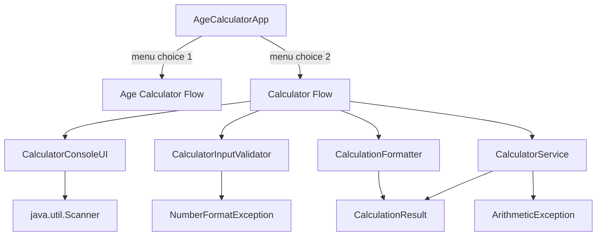

# Technical Specification

# 0. Agent Action Plan

## 0.1 Intent Clarification


### 0.1.1 Core Feature Objective

Based on the prompt, the Blitzy platform understands that the new feature requirement is to **add an arithmetic Calculator feature** to the existing repository that accepts two numbers and an arithmetic operation as input, performs the specified operation on the two numbers, and displays the result to the user.

**Feature Requirements with Enhanced Clarity:**

- **F-001 — Dual Number Input:** The calculator must accept exactly two numeric values (supporting both integer and floating-point numbers) as input from the user
- **F-002 — Operation Selection:** The calculator must accept an arithmetic operation identifier as input, supporting at minimum the four basic operations: addition (`+`), subtraction (`-`), multiplication (`*`), and division (`/`)
- **F-003 — Computation Execution:** The calculator must perform the user-specified arithmetic operation on the two provided numbers and produce the correct result
- **F-004 — Result Display:** The calculator must display the computed result to the user in a clear, human-readable format (e.g., `5.0 + 3.0 = 8.0`)
- **F-005 — Error Handling:** The calculator must gracefully handle edge cases including division by zero, invalid numeric input, and unsupported operations with meaningful error messages

**Implicit Requirements Surfaced:**

- The repository currently contains only a placeholder `README.md` file (content: `# 12feb_7`) and the existing tech spec describes a planned Java 21 Age Calculator application using Maven Standard Directory Layout — this new Calculator feature must integrate with that planned architecture
- Input validation is required to ensure the user provides valid numeric values and a recognized operation symbol
- Division by zero must be handled explicitly with a descriptive error message rather than allowing a runtime exception
- The `double` data type should be used for numeric operands to support both integer and decimal inputs
- The feature must follow the same OOP architecture and coding conventions established in the Age Calculator project plan (SRP, clean separation of concerns, layered package structure)
- Unit tests must cover all supported operations, edge cases, and invalid input scenarios
- The `README.md` must be updated to document the new Calculator feature alongside the Age Calculator documentation

### 0.1.2 Special Instructions and Constraints

**Architectural Requirements:**

- Follow the existing repository conventions established in the Age Calculator project plan: Maven Standard Directory Layout, `com.agecalculator` root package, layered architecture (model, service, validator, formatter, ui)
- Integrate with the existing `AgeCalculatorApp.java` entry point by adding a menu system that allows the user to choose between the Age Calculator and the new arithmetic Calculator
- Maintain backward compatibility — the existing Age Calculator functionality must remain fully operational after the Calculator feature is added
- Use the same build system (`pom.xml` with Maven) and testing framework (JUnit 5) already planned for the project

**Special Directives:**

- The Calculator must operate as a console-based feature using `java.util.Scanner` for input, consistent with the existing `ConsoleUI` pattern
- All arithmetic operations must be encapsulated in a dedicated service class following the Single Responsibility Principle
- The modulus operator (`%`) should also be supported as an implicit best practice for a complete arithmetic calculator
- No external dependencies are required beyond what the Age Calculator project already specifies (JDK 21 standard library + JUnit 5 for testing)

### 0.1.3 Technical Interpretation

These feature requirements translate to the following technical implementation strategy:

- To **accept two numbers and an operation**, we will **create** `CalculatorConsoleUI.java` in the `ui` package with prompt methods that use `java.util.Scanner` to read two `double` values and one `char` operator from the console
- To **validate user input**, we will **create** `CalculatorInputValidator.java` in the `validator` package to verify that inputs are valid numbers and the operation is a recognized arithmetic operator (`+`, `-`, `*`, `/`, `%`)
- To **perform arithmetic operations**, we will **create** `CalculatorService.java` in the `service` package with a `calculate(double num1, double num2, char operator)` method that uses a `switch` statement to dispatch to the correct arithmetic operation, with explicit division-by-zero guarding
- To **store and transfer results**, we will **create** `CalculationResult.java` in the `model` package as an immutable data holder containing the two operands, the operator, and the computed result
- To **format and display output**, we will **create** `CalculationFormatter.java` in the `formatter` package to produce human-readable output strings in the format `num1 operator num2 = result`
- To **integrate with the application**, we will **modify** `AgeCalculatorApp.java` to present a main menu allowing the user to select either "Age Calculator" or "Arithmetic Calculator", routing to the appropriate feature flow
- To **ensure correctness**, we will **create** test classes `CalculatorServiceTest.java` and `CalculatorInputValidatorTest.java` covering all operations, edge cases, and validation scenarios


## 0.2 Repository Scope Discovery


### 0.2.1 Comprehensive File Analysis

**Current Repository State:**

The repository contains a single file at the root level. All other files referenced below are from the planned Age Calculator application architecture described in the existing tech spec (Sections 0.1–0.8), which have not yet been created on disk.

| File Path | Status | Content Summary |
|-----------|--------|-----------------|
| `README.md` | EXISTS | Contains only `# 12feb_7` — placeholder heading with no documentation |

**Search Patterns Applied (Verified Empty Repository):**

| Pattern | Target | Result |
|---------|--------|--------|
| `**/*.java` | Java source files | No files found |
| `pom.xml`, `build.gradle` | Build configuration | No files found |
| `**/*Test.java`, `**/*Spec.java` | Test files | No files found |
| `**/*.yml`, `**/*.yaml`, `**/*.xml` | Configuration files | No files found |
| `src/**/*` | Source directory tree | No directory exists |
| `Dockerfile*`, `.github/workflows/*` | Build/deployment | No files found |

**Planned Files Requiring Modification for Calculator Feature Integration:**

The following files are part of the planned Age Calculator architecture (per existing tech spec Sections 0.4 and 0.5) and will need to be modified to accommodate the new Calculator feature:

| Planned File | Modification Required | Reason |
|-------------|----------------------|--------|
| `src/main/java/com/agecalculator/AgeCalculatorApp.java` | Add main menu routing logic | Entry point must present a menu to choose between Age Calculator and Arithmetic Calculator |
| `README.md` | Add Calculator feature documentation | Must include Calculator usage instructions, supported operations, and sample I/O alongside Age Calculator docs |

**Integration Point Discovery:**

- **Application entry point:** `AgeCalculatorApp.java` — needs a menu system to route between features
- **UI layer:** New `CalculatorConsoleUI.java` will follow the same pattern as `ConsoleUI.java`
- **Service layer:** New `CalculatorService.java` will be a peer to `AgeCalculationService.java`
- **Model layer:** New `CalculationResult.java` will be a peer to `AgeResult.java`
- **Validator layer:** New `CalculatorInputValidator.java` will be a peer to `DateInputValidator.java`
- **Formatter layer:** New `CalculationFormatter.java` will be a peer to `AgeFormatter.java`
- **Test layer:** New test classes will follow the same JUnit 5 patterns as existing planned tests

### 0.2.2 Web Search Research Conducted

The following research was conducted to validate best practices for the Calculator feature implementation:

| Research Topic | Key Findings | Sources |
|---------------|-------------|---------|
| Java calculator with two numbers and operation | The standard approach uses `switch-case` to dispatch operations based on a `char` operator; `double` data type recommended for both integer and floating-point support | Programiz, TutorialsPoint, BeginnersBook |
| Java arithmetic calculator OOP best practices | Encapsulate each operation in a dedicated service class with separate methods; use `IllegalArgumentException` for division by zero; modular design with separation of input/computation/output | JavaSpring.net, IT Trip, Codecademy |
| Calculator design patterns in Java | Strategy pattern and Facade pattern are common for extensible calculators; simple calculators use switch-case within a service method; `enum`-based operation dispatch for advanced designs | GitHub OOP examples, OODesign.com |
| Division by zero handling in Java | Best practice: check divisor before operation and throw `ArithmeticException` or `IllegalArgumentException` with message `"Cannot divide by zero"`; never rely on `Double.POSITIVE_INFINITY` silently | Baeldung, KnowProgram |

### 0.2.3 New File Requirements

**New Source Files to Create:**

| # | File Path | Purpose |
|---|-----------|---------|
| 1 | `src/main/java/com/agecalculator/model/CalculationResult.java` | Immutable data holder for calculator results — stores `num1` (double), `num2` (double), `operator` (char), and `result` (double) |
| 2 | `src/main/java/com/agecalculator/service/CalculatorService.java` | Core arithmetic service with `CalculationResult calculate(double num1, double num2, char operator)` method implementing addition, subtraction, multiplication, division, and modulus via switch-case |
| 3 | `src/main/java/com/agecalculator/validator/CalculatorInputValidator.java` | Input validation class: `double parseNumber(String input)` to validate numeric input, `char parseOperator(String input)` to validate operation symbol, `void validateDivision(double num2, char operator)` to guard against division by zero |
| 4 | `src/main/java/com/agecalculator/formatter/CalculationFormatter.java` | Output formatter with `String formatResult(CalculationResult result)` returning `"num1 operator num2 = result"` and `String formatError(String message)` for error display |
| 5 | `src/main/java/com/agecalculator/ui/CalculatorConsoleUI.java` | Console interface using `Scanner` with methods: `String promptFirstNumber()`, `String promptSecondNumber()`, `String promptOperator()`, `void displayResult(String message)`, `void displayError(String message)` |

**New Test Files to Create:**

| # | File Path | Purpose |
|---|-----------|---------|
| 6 | `src/test/java/com/agecalculator/service/CalculatorServiceTest.java` | JUnit 5 tests covering: addition, subtraction, multiplication, division, modulus, division by zero exception, large number handling, decimal precision |
| 7 | `src/test/java/com/agecalculator/validator/CalculatorInputValidatorTest.java` | JUnit 5 tests covering: valid number parsing, invalid number input (letters/symbols), valid operator parsing, invalid operator rejection, division by zero pre-check |
| 8 | `src/test/java/com/agecalculator/formatter/CalculationFormatterTest.java` | JUnit 5 tests covering: correct output format for each operation, error message formatting |


## 0.3 Dependency Inventory


### 0.3.1 Private and Public Packages

The Calculator feature relies exclusively on the **Java Standard Library** for its core functionality and the same **JUnit 5** dependency already planned for the Age Calculator project. No additional private or public packages are required for this feature addition.

| Registry | Package Name | Version | Scope | Purpose |
|----------|-------------|---------|-------|---------| 
| JDK Standard Library | `java.util.Scanner` | 21.0.10 (bundled with JDK 21) | Runtime | Reads two numbers and an operator from console input |
| JDK Standard Library | `java.lang.Double` | 21.0.10 (bundled with JDK 21) | Runtime | Parses string input into double-precision floating-point operands via `Double.parseDouble()` |
| JDK Standard Library | `java.lang.Math` | 21.0.10 (bundled with JDK 21) | Runtime | Potential use for rounding or precision operations on calculation results |
| JDK Standard Library | `java.lang.String` | 21.0.10 (bundled with JDK 21) | Runtime | String formatting for result output via `String.format()` |
| JDK Standard Library | `java.lang.ArithmeticException` | 21.0.10 (bundled with JDK 21) | Runtime | Exception type for division by zero error signaling |
| JDK Standard Library | `java.lang.IllegalArgumentException` | 21.0.10 (bundled with JDK 21) | Runtime | Exception type for invalid operator or non-numeric input |
| JDK Standard Library | `java.lang.NumberFormatException` | 21.0.10 (bundled with JDK 21) | Runtime | Caught during numeric input parsing to detect non-numeric strings |
| Maven Central | `org.junit.jupiter:junit-jupiter` | 5.10.2 | Test | JUnit 5 test framework for unit tests — `@Test`, `assertEquals()`, `assertThrows()` |
| Maven Central | `org.apache.maven.plugins:maven-compiler-plugin` | 3.12.1 | Build | Java 21 source/target compilation |
| Maven Central | `org.apache.maven.plugins:maven-surefire-plugin` | 3.2.5 | Build | Executes JUnit 5 tests during Maven `test` phase |

**No new dependencies need to be added** to the `pom.xml` beyond what the Age Calculator project already defines. The Calculator feature is a pure Java Standard Library feature.

### 0.3.2 Dependency Updates

Since the Calculator feature uses only Java Standard Library APIs and the project's existing JUnit 5 test dependency, there are no dependency additions or version changes required.

**Import Requirements (New Creations):**

All import statements for the Calculator feature files are new. The following import patterns will be established:

- `src/main/java/com/agecalculator/service/CalculatorService.java` — Import `com.agecalculator.model.CalculationResult`
- `src/main/java/com/agecalculator/validator/CalculatorInputValidator.java` — No external imports; uses `java.lang` classes (auto-imported)
- `src/main/java/com/agecalculator/formatter/CalculationFormatter.java` — Import `com.agecalculator.model.CalculationResult`
- `src/main/java/com/agecalculator/ui/CalculatorConsoleUI.java` — Import `java.util.Scanner`
- `src/test/java/com/agecalculator/**/*Test.java` — Import `org.junit.jupiter.api.Test`, `static org.junit.jupiter.api.Assertions.*`, plus the classes under test

**External Reference Updates:**

| File | Update Type | Description |
|------|-----------|-------------|
| `pom.xml` | NO CHANGE | No new dependencies needed — existing JUnit 5 and plugin configuration suffices |
| `README.md` | UPDATE | Add Calculator feature usage documentation, supported operations, and sample I/O |
| `.gitignore` | NO CHANGE | Existing rules already cover compiled output and IDE artifacts |


## 0.4 Integration Analysis


### 0.4.1 Existing Code Touchpoints

The Calculator feature integrates with the planned Age Calculator application at multiple architectural layers. Since the repository is currently empty and the Age Calculator project has been specified but not yet built, all touchpoints reference the planned file structure from the existing tech spec.

**Direct Modifications Required:**

| File | Modification | Details |
|------|-------------|---------|
| `src/main/java/com/agecalculator/AgeCalculatorApp.java` | Add main menu system | Insert a menu loop at the beginning of `main()` that presents options: `1. Age Calculator`, `2. Arithmetic Calculator`, `3. Exit`. Based on user choice, route to the existing Age Calculator flow or the new Calculator feature flow. Import `CalculatorService`, `CalculatorInputValidator`, `CalculationFormatter`, and `CalculatorConsoleUI`. |
| `README.md` | Add Calculator section | Append a "Calculator Feature" section documenting: supported operations (`+`, `-`, `*`, `/`, `%`), input format, sample I/O, and error handling behavior |

**Dependency Injection / Wiring Points:**

The Calculator feature follows the same instantiation pattern as the Age Calculator — direct object creation in the `main()` method rather than a DI container. The integration wiring occurs in `AgeCalculatorApp.java`:

```java
CalculatorConsoleUI calcUI = new CalculatorConsoleUI(scanner);
CalculatorInputValidator calcValidator = new CalculatorInputValidator();
CalculatorService calcService = new CalculatorService();
CalculationFormatter calcFormatter = new CalculationFormatter();
```

**Cross-Component Dependency Flow:**



**Shared Resources:**

| Resource | Shared Between | Notes |
|----------|---------------|-------|
| `java.util.Scanner` instance | `ConsoleUI` and `CalculatorConsoleUI` | A single `Scanner` instance should be created in `AgeCalculatorApp.main()` and passed to both UI classes to avoid multiple `System.in` readers |
| `README.md` | Age Calculator docs and Calculator docs | Both features documented in a single README with clear section separation |
| `pom.xml` | Entire project | Build configuration shared — no changes needed for this feature |

**No Database or Schema Changes Required:**

The Calculator feature is a pure computational feature with no persistence requirements. No migration files, schema changes, or data model updates are needed.


## 0.5 Technical Implementation


### 0.5.1 File-by-File Execution Plan

Every file listed below MUST be created or modified as part of this feature addition. Files are grouped by architectural concern.

**Group 1 — Core Feature Files (CREATE):**

| # | File Path | Action | Purpose |
|---|-----------|--------|---------|
| 1 | `src/main/java/com/agecalculator/model/CalculationResult.java` | CREATE | Immutable data class with fields: `double num1`, `double num2`, `char operator`, `double result`. Constructor accepting all four fields. Getter methods for each field. `toString()` override for debug output. |
| 2 | `src/main/java/com/agecalculator/service/CalculatorService.java` | CREATE | Core service class with method `CalculationResult calculate(double num1, double num2, char operator)`. Uses a `switch` statement to dispatch: `+` → addition, `-` → subtraction, `*` → multiplication, `/` → division (with zero-check), `%` → modulus (with zero-check). Throws `ArithmeticException` for division/modulus by zero. Throws `IllegalArgumentException` for unsupported operators. |
| 3 | `src/main/java/com/agecalculator/validator/CalculatorInputValidator.java` | CREATE | Validator class with: (a) `double parseNumber(String input)` using `Double.parseDouble()` wrapped in try-catch for `NumberFormatException`; (b) `char parseOperator(String input)` that validates the input is one of `+`, `-`, `*`, `/`, `%`; (c) `void validateNotDivisionByZero(double num2, char operator)` that pre-checks divisor before computation. |
| 4 | `src/main/java/com/agecalculator/formatter/CalculationFormatter.java` | CREATE | Formatter class with: (a) `String formatResult(CalculationResult result)` returning `"num1 operator num2 = result"` format; (b) `String formatError(String errorMessage)` returning `"Error: errorMessage"` format. |
| 5 | `src/main/java/com/agecalculator/ui/CalculatorConsoleUI.java` | CREATE | Console interface class accepting a `Scanner` instance. Methods: `String promptFirstNumber()` to display `"Enter first number: "` and read input, `String promptSecondNumber()` for the second number, `String promptOperator()` to display `"Enter operation (+, -, *, /, %): "` and read input, `void displayResult(String message)` to print to `System.out`, `void displayError(String message)` to print to `System.err`. |

**Group 2 — Integration Modifications (MODIFY):**

| # | File Path | Action | Purpose |
|---|-----------|--------|---------|
| 6 | `src/main/java/com/agecalculator/AgeCalculatorApp.java` | MODIFY | Add a main menu loop at the start of `main()` presenting feature choices. Add import statements for all Calculator classes. Add a `runCalculator()` helper method that orchestrates the Calculator flow: prompt → validate → calculate → format → display. Share the `Scanner` instance between Age Calculator and Calculator features. |
| 7 | `README.md` | MODIFY | Add an "Arithmetic Calculator" section with: feature description, supported operations table, usage instructions, sample input/output, and error handling examples. |

**Group 3 — Tests (CREATE):**

| # | File Path | Action | Purpose |
|---|-----------|--------|---------|
| 8 | `src/test/java/com/agecalculator/service/CalculatorServiceTest.java` | CREATE | JUnit 5 test class covering: addition (positive, negative, decimal), subtraction, multiplication, division (normal and by-zero), modulus (normal and by-zero), unsupported operator, large numbers, precision edge cases |
| 9 | `src/test/java/com/agecalculator/validator/CalculatorInputValidatorTest.java` | CREATE | JUnit 5 test class covering: valid integer parsing, valid decimal parsing, invalid input (letters, symbols, empty string), valid operator parsing for all 5 operators, invalid operator rejection, division by zero pre-check |
| 10 | `src/test/java/com/agecalculator/formatter/CalculationFormatterTest.java` | CREATE | JUnit 5 test class covering: correct format string for each operator, error message formatting, result with decimal precision |

**Total Files: 10** (8 new + 2 modified)

### 0.5.2 Implementation Approach per File

**Step 1 — Establish the data model** by creating `CalculationResult.java` as an immutable value object that encapsulates all computation data, enabling clean data transfer between service and formatter layers.

**Step 2 — Build the computation engine** by creating `CalculatorService.java` with a single public method that accepts two operands and an operator, dispatches to the correct arithmetic operation via `switch`, and returns a populated `CalculationResult`. Division-by-zero guarding is the critical safety check in this class:

```java
case '/': if (num2 == 0) throw new ArithmeticException("Cannot divide by zero");
          return new CalculationResult(num1, num2, '/', num1 / num2);
```

**Step 3 — Implement input validation** by creating `CalculatorInputValidator.java` that converts raw string input into typed values, catching `NumberFormatException` and wrapping it in `IllegalArgumentException` with a user-friendly message.

**Step 4 — Create output formatting** by creating `CalculationFormatter.java` that converts a `CalculationResult` into a human-readable display string using `String.format()`.

**Step 5 — Build the console interface** by creating `CalculatorConsoleUI.java` that handles all user prompts and result display, receiving a shared `Scanner` instance via constructor injection.

**Step 6 — Integrate with the application** by modifying `AgeCalculatorApp.java` to add a menu system and Calculator flow orchestration.

**Step 7 — Ensure quality** by creating comprehensive JUnit 5 test classes for the service, validator, and formatter, covering all positive, negative, and edge-case scenarios.

**Step 8 — Update documentation** by modifying `README.md` to include the Calculator feature section.

### 0.5.3 User Interface Design

The Calculator feature uses a console-based character user interface (CUI), consistent with the existing Age Calculator design. The interaction flow is:

**Main Menu (added to AgeCalculatorApp):**
```
=== Application Menu ===
1. Age Calculator
2. Arithmetic Calculator
3. Exit
Choose an option:
```

**Calculator Flow:**
```
Enter first number: 10
Enter second number: 5
Enter operation (+, -, *, /, %): +
10.0 + 5.0 = 15.0
```

**Error Scenarios:**

- Invalid number: `Error: Invalid number input. Please enter a valid numeric value.`
- Invalid operator: `Error: Unsupported operation 'x'. Please use +, -, *, /, or %.`
- Division by zero: `Error: Cannot divide by zero.`

The UI follows a linear prompt-response pattern: prompt first number → prompt second number → prompt operator → display result or error. After each calculation, the user is returned to the main menu to perform another operation or exit.


## 0.6 Scope Boundaries


### 0.6.1 Exhaustively In Scope

**All Feature Source Files (CREATE):**

- `src/main/java/com/agecalculator/model/CalculationResult.java` — Immutable data model for calculation input/output
- `src/main/java/com/agecalculator/service/CalculatorService.java` — Core arithmetic computation engine
- `src/main/java/com/agecalculator/validator/CalculatorInputValidator.java` — Input parsing and validation
- `src/main/java/com/agecalculator/formatter/CalculationFormatter.java` — Result output formatting
- `src/main/java/com/agecalculator/ui/CalculatorConsoleUI.java` — Console user interface

**All Feature Test Files (CREATE):**

- `src/test/java/com/agecalculator/service/CalculatorServiceTest.java` — Unit tests for all arithmetic operations and edge cases
- `src/test/java/com/agecalculator/validator/CalculatorInputValidatorTest.java` — Unit tests for input validation logic
- `src/test/java/com/agecalculator/formatter/CalculationFormatterTest.java` — Unit tests for output formatting

**Integration Points (MODIFY):**

- `src/main/java/com/agecalculator/AgeCalculatorApp.java` — Add main menu system and Calculator feature routing
- `README.md` — Add Arithmetic Calculator documentation section

**Wildcard Patterns:**

- `src/main/java/com/agecalculator/**/Calculator*.java` — All Calculator-related source files
- `src/main/java/com/agecalculator/model/Calculation*.java` — Calculator data models
- `src/test/java/com/agecalculator/**/Calculator*.java` — All Calculator-related test files
- `src/test/java/com/agecalculator/**/Calculation*.java` — Calculator formatter tests

**Functional Requirements In Scope:**

- Accept two numeric values (integer or decimal) from the user via console
- Accept an arithmetic operation symbol (`+`, `-`, `*`, `/`, `%`) from the user
- Perform the specified operation on the two numbers
- Display the result in `num1 operator num2 = result` format
- Handle division by zero with a meaningful error message
- Handle invalid numeric input with a descriptive error message
- Handle unsupported operators with a descriptive error message
- Integrate the Calculator feature into the application menu alongside the Age Calculator
- Support both integer and floating-point input using `double` data type
- Return to the main menu after each calculation for repeated use

### 0.6.2 Explicitly Out of Scope

- **Expression parsing or multi-operation chains:** Only two operands and one operator per calculation; no support for expressions like `2 + 3 * 4`
- **Operation history or memory functions:** No storing or recalling previous calculations
- **Scientific calculator operations:** No trigonometric, logarithmic, exponential, or root functions
- **GUI for the Calculator:** The Calculator feature is console-only; the optional Swing GUI enhancement applies only to the Age Calculator
- **Parentheses or operator precedence:** Single-operation-at-a-time design; no complex expression evaluation
- **Persistent storage:** No saving results to file or database
- **Localization or internationalization:** Decimal separator is always `.` (period); no locale-dependent formatting
- **Network or API exposure:** No REST API or remote access to the Calculator
- **Modifications to existing Age Calculator logic:** The Age Calculator service, model, validator, formatter, and UI remain unchanged
- **Changes to `pom.xml` dependencies:** No new Maven dependencies needed
- **CI/CD or deployment configuration:** No Docker, GitHub Actions, or deployment changes
- **Performance benchmarking:** No performance testing or optimization requirements


## 0.7 Rules for Feature Addition


**User-Specified Requirements:**

- The Calculator must accept exactly 2 numbers as input
- The Calculator must accept an operation as input
- The Calculator must perform the specified operation on the 2 numbers
- The Calculator must output the result of the operation

**Architectural Consistency Rules:**

- All new classes must reside within the existing `com.agecalculator` package hierarchy, following the established layer structure: `model`, `service`, `validator`, `formatter`, `ui`
- Each new class must follow the Single Responsibility Principle — one class, one concern
- The Calculator feature must not modify or break any existing Age Calculator functionality
- The shared `Scanner` instance must be passed via constructor injection to `CalculatorConsoleUI` to avoid creating multiple `System.in` readers
- All public classes must include class-level Javadoc comments describing their purpose
- Method names must follow `camelCase`, class names must follow `PascalCase`, package names must be all lowercase

**Input/Output Rules:**

- Numeric inputs must be parsed as `double` to support both integer values (e.g., `5`) and decimal values (e.g., `3.14`)
- Supported operators: `+` (addition), `-` (subtraction), `*` (multiplication), `/` (division), `%` (modulus)
- Output format must be: `num1 operator num2 = result` (e.g., `10.0 + 5.0 = 15.0`)
- All error messages must be descriptive and actionable, printed to `System.err`

**Error Handling Rules:**

- Division by zero (`/` or `%` with second number `0`) must throw `ArithmeticException` with message `"Cannot divide by zero"`
- Non-numeric input must be caught via `NumberFormatException` and reported as `"Invalid number input. Please enter a valid numeric value."`
- Unsupported operator symbols must throw `IllegalArgumentException` with message `"Unsupported operation '[symbol]'. Please use +, -, *, /, or %."`
- All exceptions must be caught at the application orchestration layer (`AgeCalculatorApp`) and displayed to the user via the UI — services and validators must never print directly to console

**Testing Rules:**

- Every arithmetic operation must have at least one positive test case with known expected output
- Division by zero must be tested using `assertThrows(ArithmeticException.class, ...)`
- Invalid input scenarios must be tested using `assertThrows(IllegalArgumentException.class, ...)`
- Test classes must use JUnit 5 annotations (`@Test`) and assertion methods (`assertEquals`, `assertThrows`)
- No `System.out.println()` calls in test classes — use assertions only

**Coding Standards (Consistent with Age Calculator Project):**

- No `System.exit()` calls outside of the main method
- No `System.out.println()` calls outside of the UI layer
- Constants (e.g., supported operator characters) must be `static final` with `UPPER_SNAKE_CASE` naming
- All public methods must have Javadoc comments
- The `CalculationResult` class must be immutable — no setter methods


## 0.8 References


### 0.8.1 Repository Files and Folders Searched

The following repository inspection operations were performed to derive the conclusions in this Agent Action Plan:

| # | Tool Used | Target Path / Query | Result |
|---|-----------|-------------------|--------|
| 1 | `bash` (find) | `find / -name ".blitzyignore"` | No `.blitzyignore` files found anywhere on the system |
| 2 | `get_source_folder_contents` | Root path (`""`) | Repository contains only `README.md` (status: UNCHANGED) — confirmed greenfield repository |
| 3 | `read_file` | `README.md` [1, -1] | File contains only `# 12feb_7` — a placeholder heading with no documentation |
| 4 | `bash` (ls) | `/tmp/environments_files/` | Directory does not exist — no environment files provided by the user |
| 5 | `bash` (find) | `find . -type f` (excluding `.git/`) | Confirmed only `README.md` exists in repository |
| 6 | `bash` (find) | `find . -type d` (excluding `.git/`) | Confirmed no source directories exist |
| 7 | `bash` (java) | `java -version` | Java not installed initially; installed OpenJDK 21.0.10+7-1~24.04 |
| 8 | `bash` (mvn) | `mvn -version` | Maven not installed initially; installed Apache Maven 3.8.7 |
| 9 | `get_tech_spec_section` | `0.1 Intent Clarification` | Retrieved Age Calculator project plan — core objectives, technical interpretation, sample I/O |
| 10 | `get_tech_spec_section` | `0.2 Source Analysis` | Retrieved source file discovery — confirmed empty repository, README-only baseline |
| 11 | `get_tech_spec_section` | `0.3 Scope Boundaries` | Retrieved in-scope/out-of-scope definitions for the Age Calculator project |
| 12 | `get_tech_spec_section` | `0.4 Target Design` | Retrieved target architecture — Maven Standard Directory Layout, class hierarchy, design patterns |
| 13 | `get_tech_spec_section` | `0.5 Transformation Mapping` | Retrieved file-by-file transformation plan — 15 planned files for Age Calculator |
| 14 | `get_tech_spec_section` | `0.6 Dependency Inventory` | Retrieved dependency list — JDK Standard Library APIs + JUnit 5.10.2 + Maven plugins |
| 15 | `get_tech_spec_section` | `0.7 Refactoring Rules` | Retrieved coding standards, test cases, and special constraints for the project |
| 16 | `get_tech_spec_section` | `0.8 References` | Retrieved prior reference list — web research sources and repository scan results |

### 0.8.2 Web Research Conducted

| # | Search Query | Key Findings |
|---|-------------|-------------|
| 1 | "Java calculator two numbers operation design pattern" | Standard approach uses `switch-case` for operation dispatch; `double` data type supports both integer and decimal; division-by-zero requires explicit guard |
| 2 | "Java arithmetic calculator service OOP best practices" | Encapsulate operations in a service class with separate methods; use `IllegalArgumentException` for invalid input; modular design with separation of input, computation, and output layers |

### 0.8.3 Existing Tech Spec Sections Referenced

The following existing tech spec sections provided critical context for aligning the Calculator feature with the planned application architecture:

| Section | Key Information Extracted |
|---------|-------------------------|
| 0.1 Intent Clarification | Java 21 runtime, OOP architecture, Maven Standard Directory Layout, `com.agecalculator` package structure |
| 0.2 Source Analysis | Repository is empty (only `README.md`), greenfield project confirmed |
| 0.4 Target Design | Layered architecture: model, service, validator, formatter, ui packages; class responsibility assignments |
| 0.5 Transformation Mapping | File-by-file plan for Age Calculator — 15 files (1 update + 14 create); cross-file import dependencies |
| 0.6 Dependency Inventory | JDK 21 Standard Library, JUnit Jupiter 5.10.2, Maven plugins (compiler 3.12.1, surefire 3.2.5, exec 3.1.0) |
| 0.7 Refactoring Rules | Coding standards, naming conventions, exception handling rules, test case requirements |

### 0.8.4 Attachments and External Resources

- **Attachments provided:** None — the user provided 0 attachments and 0 environment files
- **Figma URLs provided:** None — no Figma screens or design system references were specified
- **Environment variables provided:** None — no environment variables or secrets were configured
- **Setup instructions provided:** None — the user stated "None provided" for setup instructions


